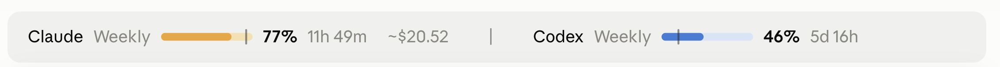

# Usage Glance

Shows your Claude plan usage, and your Codex usage if you use Codex, in one line above the prompt in the Code tab of the Claude desktop app. Free and open source; not made or endorsed by Anthropic or OpenAI.



Each side shows the percentage of the weekly limit used and the time to its reset. The five-hour window, which Claude calls **Session** (not this chat), takes over at 90%. `~$` is Claude Code's own estimate of this chat's cost at API prices, as `/usage` shows it; on a Pro or Max plan it is not a charge. Warnings start with `!`. Run `/usage-glance` to refresh and print the details.

## Requirements

The Code tab of the Claude desktop app, and Claude Code v2.1.287 or later. For Codex, optional: macOS, Node.js, and the Codex CLI signed in with ChatGPT. On Windows the line shows Claude alone.

## Install

```bash
claude plugin marketplace add RaySu/usage-glance
claude plugin install usage-glance@usage-glance
```

Then start a new chat in the Code tab. Turn it off in **+ > Plugins > Manage plugins**. The `codex` setting (`/plugin configure usage-glance@usage-glance`) is `auto` by default, which hides a Codex that is signed out or unused here for a week; set it to `always` or `never` to override that.

## What it runs, sends and keeps

There is no telemetry, and nothing is sent to the author.

- **Claude:** reads the rate-limit figures Claude Code receives with each reply. Asks `api.anthropic.com` for your plan usage, the request Claude's own usage screen makes (not a documented API), through Claude Code's credential, so the plugin never sees your token. It asks only when the reply figures are over 10 minutes old, after a reset, while a limit is spent, or when you run `/usage-glance`, and one open chat asks for all. Reads your Claude account id from Claude Code's environment or `~/.claude.json` to keep accounts apart.
- **Codex:** runs a small Node.js helper that starts `codex app-server` (plugins off) to read the sign-in and limits, which Codex fetches from OpenAI with its own sign-in: every 5 to 30 minutes, while it is in use. Runs `codex login status` while it is signed out. Once a minute, searches the Codex session logs written in the last 30 minutes (`find`, `stat`, `head`, `tail`, `grep`, each run directly, never through a shell) for the lines that mark a task starting or ending, to show what is running.
- **This machine:** runs `date +%z` for the time zone (on Windows, `reg query` for the time-zone setting `ActiveTimeBias`) and looks for `node` and `codex` in the usual install folders.
- **Hooks:** it watches session starts, `/clear`, each reply's measurements and turn ends, and draws the line above the prompt; it changes none of these. It answers its own `/usage-glance` command and no other.
- **Kept:** the latest readings and request status, in Claude Code's storage for this plugin.

## License

[MIT](LICENSE)
